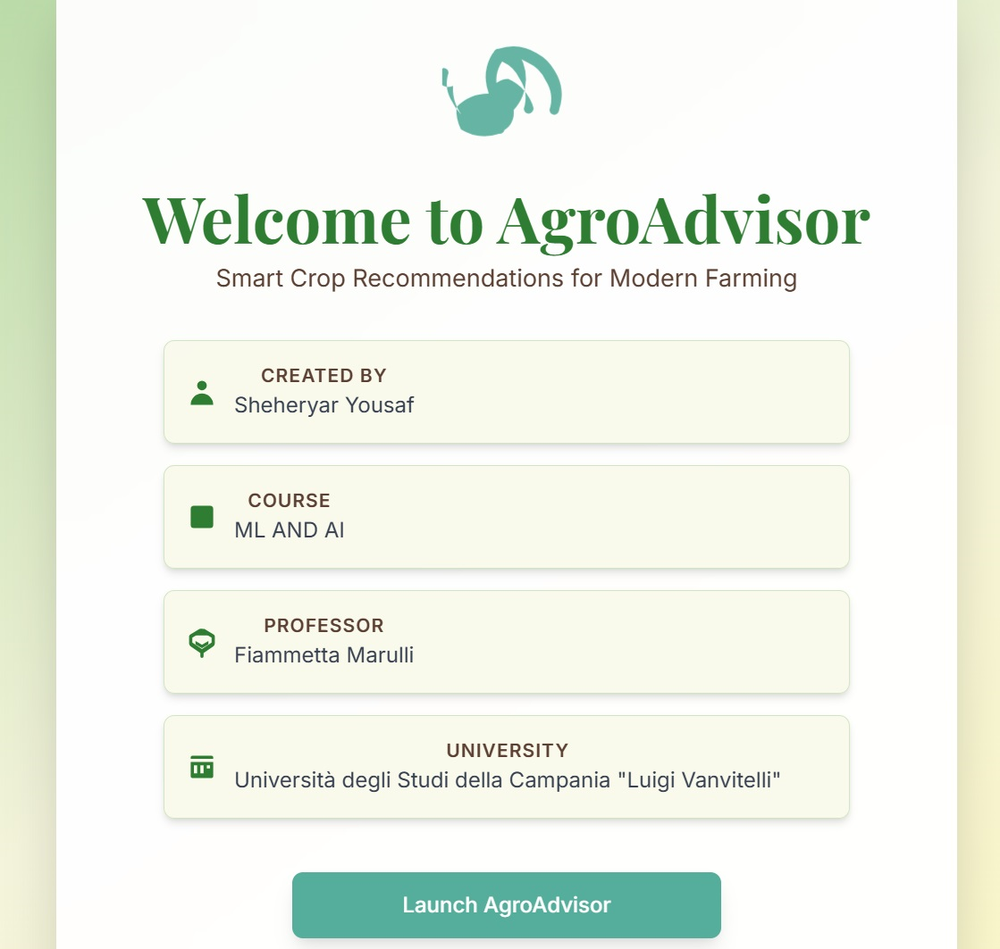
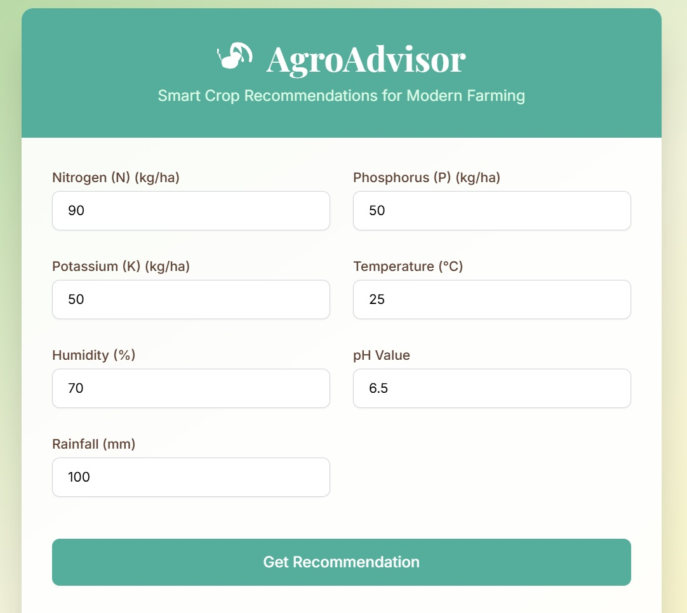
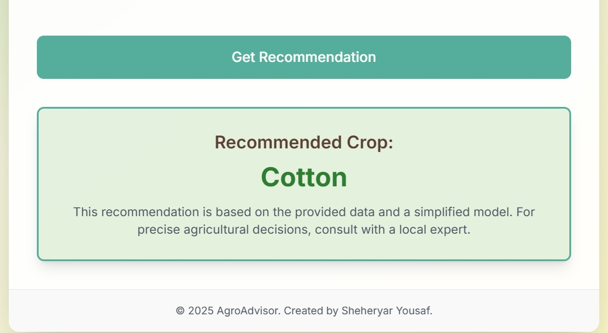

# Crop Recommendation Project

## Project Overview

Below are screenshots of the AgroAdvisor application in action:

### Welcome Screen


### Input Form


### Recommendation Output


This project combines a React-based web application with a Jupyter notebook for data analysis and visualization. It uses a trained machine learning model to recommend crops based on input data.

## Project Structure

- **Frontend (React + Vite):**
  - `App.tsx`, `index.tsx`, `components/`, `services/`, `constants.ts`, `types.ts`, `index.html`, `vite.config.ts`, `tsconfig.json`, `package.json`, `package-lock.json`, `node_modules/`
- **Data & ML:**
  - `notebook.ipynb`: Contains data analysis, visualization, and model training.
  - `best_random_forest_model.pkl`: Trained machine learning model.
  - `Crop_recommendation.csv`: Dataset used for training the model.
- **Configuration:**
  - `.gitignore`, `metadata.json`, `README.md`

## Run Locally

**Prerequisites:** Node.js

1. Install dependencies:
   ```
   npm install
   ```
2. Run the app:
   ```
   npm run dev
   ```

## Jupyter Notebook

The `notebook.ipynb` file contains detailed data analysis, visualizations, and the process of training the machine learning model. Open it in Jupyter Lab or Jupyter Notebook to explore the data and model.

## Dataset

The `Crop_recommendation.csv` file contains the dataset used for training the model. It includes various features that influence crop recommendations.

## App Visualization

The main app is built using React and Vite. It provides a user interface for inputting data and receiving crop recommendations based on the trained model. The app supports hot-reloading, so changes are reflected in the browser automatically.

## License

This project is licensed under the MIT License - see the LICENSE file for details.
